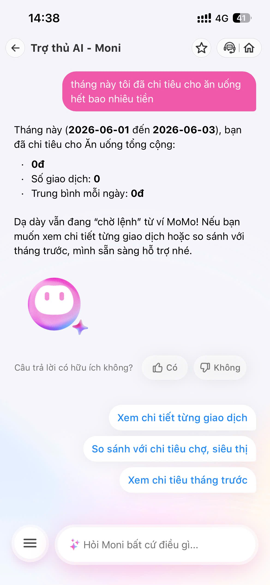

# Workshop — Mổ App AI Thật

**Thời gian:** 35-45 phút  
**Hình thức:** cá nhân trước, chia sẻ theo nhóm sau  
**Output:** finding note + sketch `as-is / to-be`

Mục tiêu không phải chấm "UI đẹp hay xấu". Mục tiêu là dùng sản phẩm thật như một bài needfinding: tìm chỗ product gãy trong workflow thật, rồi viết finding đó thành quyết định product.

## 1. Chọn một sản phẩm để dùng thử

| Sản phẩm | AI feature | Cách truy cập |
|---|---|---|
| MoMo — Moni | Trợ thủ tài chính, phân tích chi tiêu, chatbot | App MoMo |
| Vietnam Airlines — NEO | Chatbot hỗ trợ vé, hành lý, khiếu nại | Website/Zalo VNA |
| V-App — V-AI | Trợ lý voice/text, gợi ý theo ngữ cảnh | App V-App |
| App theo track nhóm | App thật nhóm đang chọn cho hackathon | Cần screenshot/link |

## 2. Dùng thử: promise vs reality

Ghi nhanh:

- Product hứa gì?
    - Moni sẽ là trợ lý của Momo sẵn sàng hỗ trợ bạn về các dịch vụ và thông tin liên quan đến ví điện tử Momo.
- User nào được hứa sẽ được giúp?
    - Người dùng MoMo.
- Bạn kỳ vọng AI làm được task nào?
    - Khi hỏi "Tháng này tôi tiêu cho ăn uống hết bao nhiêu?", AI sẽ trả về con số tổng và danh sách các giao dịch liên quan.
- Khi dùng thật, điểm gãy xuất hiện ở đâu?
    - Moni chỉ trả về tổng số tiền giao dịch trong tháng chứ không thể phân loại chi tiêu.

Evidence cần có:

## 3. Vẽ 4 paths

| Path | Câu hỏi cần trả lời | Thực tế trên App |
|---|---|---|
| Happy | Khi AI đúng và tự tin, user thấy gì? | Khi hỏi "tổng chi tiêu tháng này là bao nhiêu", Moni trả về đúng con số tổng tiền. |
| Low-confidence | Khi AI không chắc, hệ thống có hỏi lại, show options hoặc chuyển người không? | Khi hỏi chi tiết về một mục cụ thể ("ăn uống"), Moni không hiểu intent lọc theo danh mục, thay vào đó trả về tổng toàn bộ giao dịch mà không đưa ra gợi ý phân loại hay hỏi lại user. App không có luồng low-confidence cho case này. |
| Failure | Khi AI sai, user biết bằng cách nào và sửa thế nào? | User đọc tin nhắn trả lời và thấy số tiền đưa ra là tổng tất cả giao dịch chứ không phải chỉ riêng mục ăn uống. User không có cách nào dạy lại bot hay sửa lỗi ngay trong khung chat. |
| Correction | Khi user sửa, correction có được lưu/log/học lại không hay biến mất? | Vì bot không có UI để user xác nhận lại hay sửa đổi category trong chat, không có correction loop nào được thực hiện. |

## 4. Viết finding thành quyết định

**Finding:**

Khi user hỏi "Tháng này tôi tiêu cho ăn uống hết bao nhiêu?",
AI/product trả về tổng tất cả các giao dịch trong tháng thay vì lọc theo danh mục (ăn uống),
hậu quả là user không theo dõi được chi tiết từng nhóm chi tiêu, gây thất vọng so với kỳ vọng ban đầu.
Lỗi thuộc layer **Intent + Data-tool**.
Nên sửa bằng cách thêm khả năng phân tách tham số (extract entity) từ câu hỏi (ví dụ: entity = "ăn uống"). Nếu backend bot hiện tại chưa thể query data theo category, cần sửa bằng **fallback UX**: "Moni hiện tại chỉ có thể tính tổng chi tiêu. Để xem chi tiết từng khoản (ăn uống, đi lại,...), bạn hãy vào mục Thống kê chi tiêu nhé", kèm theo nút bấm (Button) dẫn thẳng tới tính năng Thống kê.

## 5. Sketch as-is / to-be

**As-is:** (Luồng hiện tại, đánh dấu điểm gãy)
[ Người dùng ] "Tháng này tôi tiêu cho ăn uống hết bao nhiêu?"
      |
      v
[ Hệ thống ] Nhận diện Intent: "Tổng chi tiêu" (Thiếu tham số)
      |
      v
[ Backend ] Query: Tổng tiền giao dịch tháng hiện tại
      |
      v
[ Phản hồi ] "Tổng chi tiêu tháng này của bạn là X VND."
      |
      v
[ ĐIỂM GÃY ] Người dùng không nhận được thông tin về "Ăn uống"
             và không biết làm thế nào để xem chi tiết.
             
**To-be:** (Luồng đề xuất)

[ Người dùng ] "Tháng này tôi tiêu cho ăn uống hết bao nhiêu?"
      |
      v
[ AI NLU ] Trích xuất ý định & tham số (Time: "Tháng này", Category: "Ăn uống")
      |
      v
[ Decision Logic ] Kiểm tra khả năng hỗ trợ của hệ thống
      |
      +-----------------------------+-----------------------------+
      | (Khả năng hỗ trợ: CÓ)       | (Khả năng hỗ trợ: KHÔNG)    |
      |                             |                             |
      v                             v                             |
[ DB Query ] Lấy tổng tiền          [ Tạo thông báo ]             |
    theo Category "Ăn uống"         Giải thích hạn chế            |
      |                             |                             |
      v                             v                             |
[ Phản hồi ] "Tháng này bạn đã      [ Phản hồi ] "Xin lỗi, hiện   |
    chi X VND cho Ăn uống."             chưa tính riêng khoản này"|
      |                             |                             |
      +-------------+---------------+                             |
                    |                                             |
                    v                                             |
             [ Nút hành động ] -----------------------------------+
             ([Xem chi tiết] / [Mở Thống kê chi tiêu])

## 6. Tự kiểm trước khi nộp

- [x] Có ít nhất 1 screenshot hoặc observation cụ thể.
- [x] Có đủ 4 paths hoặc nói rõ path nào chưa có trong product.
- [x] Finding được viết thành product decision, không chỉ là nhận xét.
- [x] Sketch có as-is và to-be.
- [x] Có một câu nói rõ finding này sẽ đổi gì trong SPEC (Sẽ bổ sung nhận diện intent category hoặc bổ sung fallback UI chuyển hướng sang màn hình Thống kê).
